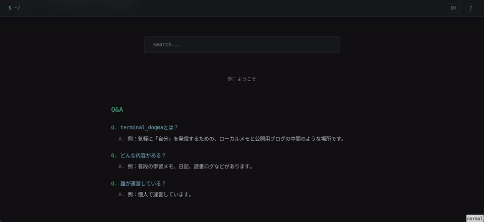

## terminal_dogma

terminal_dogmaは現在制作中の個人サイトである。  

下記のサンプルは、claude code に デザイン仕様を投げて一発目で生成されたもので、かなり再現度が高く、拡張もしやすそうだったため採用した。



> 実験的な実装のため、検索機能やUIの調整はされていない状態である。

## 目的

普段の努力や成果、私の「人となり」を**気軽**に発信したいという思いから作成した。  

既存のブログ投稿プラットフォームでは、どうしてもコミュニティの雰囲気に合わせたコンテンツ作りを意識してしまい、発信の場を使い分ける必要性を感じたのがきっかけだ。

概念的には「パーソナルポートフォリオ」としての位置づけに近く、  

- 情報整理・共有
- 自分の客観視
- 他人に自分を知ってもらう

ことを目的に、長期運用を目指す。

## デザイン仕様（プロンプト）

以下は、Claude Code に渡した設計指示の概要だ。


**全体方針**
- ターミナル画面のようなミニマルなデザイン
- 現在の配色（ダーク系）は維持  <-- カラーテーマは既に決定済みだったため

**ヘッダー**
- 透明＋ぼかし効果の固定バンド
- 左側にbash風のパス表示
- 右側に `EN` トグル（UI のみ）と `?`（aboutへのリンク）

**トップページ**
- ハンバーガーメニュー（ホバーでインデックス展開、サブメニュー付き）
- `> terminal_dogma` のタイトル
- 検索バー（UI のみ）
- ウェルカムテキスト（例：ようこそ）
- Q&A セクション（サイト紹介）
- おすすめカルーセル（20枚のカード、5枚表示、ランダム選出）

**フッター**
- 免責事項とコピーライト

---

<br>

デザイン・UIの着想は、個人的に使い分いやすいと思ったサイトから得ている。terminal風というこだわりは、無駄がなく「必要な情報はいつでも簡単に取り出せる」ことをコンセプトとしているためだ。個人的な趣味も含まれる。

今後の予定としては、まずデザイン面の細かな修正を行い、その後に未実装機能の追加や外部APIとの連携を進める。

また、現在は独自ドメインを取得し Cloudflare Pages で運用している。検索エンジンにインデックス登録する前に、今一度セキュリティチェックを行うつもりだ。

## 実行順

```bash
cd /home/yuji/repos/github/terminal_dogma
  nix develop    # 必要なときだけ
  npm run build  # 変更した内容を反映させたいとき
  python3 -m http.server -d _site 8081
```

確認: ブラウザ `http://localhost:8081/`
